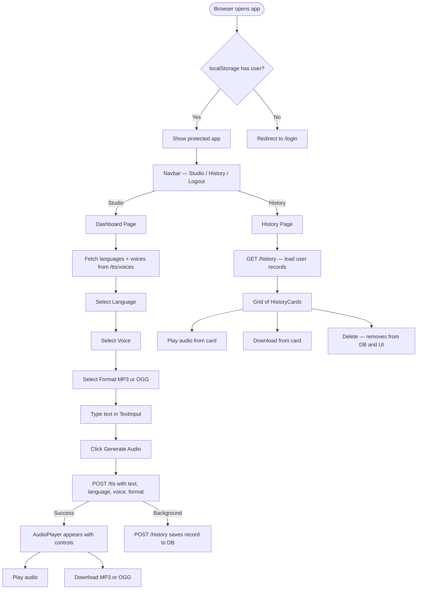

# 🎙️ AuraVox — Frontend

<div align="center">


**A premium, glassmorphism-styled Text-to-Speech Studio built with React 19 and Vite. Convert any text to lifelike audio using Amazon Polly voices across 20+ languages and multiple output formats.**

### 🌐 Live Deployment

| | URL |
|---|---|
| **🖥️ Frontend (Vercel)** | [https://text-to-speech-frontend-alpha.vercel.app](https://text-to-speech-frontend-alpha.vercel.app) |

</div>

---

## 📋 Table of Contents

1. [Overview](#-overview)
2. [Features](#-features)
3. [Application Flow](#-application-flow)
4. [Folder Structure](#-folder-structure)
5. [Tech Stack](#-tech-stack)
6. [Design System](#-design-system)
7. [Component Architecture](#-component-architecture)
8. [State Management](#-state-management)
9. [Routing](#-routing)
10. [Environment Variables](#-environment-variables)
11. [Installation & Setup](#-installation--setup)
12. [Build & Deployment](#-build--deployment)
13. [Scripts](#-scripts)
14. [Dependencies](#-dependencies)

---

## 🔍 Overview

AuraVox is a fully-featured **Text-to-Speech Studio** that lets authenticated users convert written text to lifelike spoken audio through a beautiful, modern interface. The frontend is a React 19 Single-Page Application built with Vite, styled with Tailwind CSS v4, and manages all global state through Redux Toolkit.

### What It Does

1. **Authenticate** — Users register or log in securely via JWT cookies.
2. **Select voice settings** — Choose from 20+ languages, 100+ Amazon Polly voices, and MP3 or OGG audio formats.
3. **Generate audio** — Type text (up to 1,000 characters) and click "Generate Audio" to synthesize speech.
4. **Play & Download** — The generated audio immediately appears in an inline player. Download it instantly in your chosen format.
5. **Review History** — All previously generated clips are saved and viewable on the History page with full playback and download.

---

## ✨ Features

### 🔐 Authentication
- **Register** with name, email, and password
- **Login** with email and password — JWT token stored in HTTP-only cookie by the backend
- **Protected Routes** — Unauthenticated users are automatically redirected to `/login`
- **Smart redirects** — Authenticated users visiting `/login` or `/register` are immediately redirected to `/app`
- **Logout** — Clears the server-side cookie and navigates back to the login page
- **401 Interceptor** — Axios automatically clears stale localStorage and redirects to login on session expiry

### 🎤 TTS Studio
- **Text Input** — Textarea with real-time character count (up to 1,000) and word count
- **Language Selector** — Dropdown listing all supported languages, dynamically loaded from Amazon Polly
- **Voice Selector** — Dropdown filtered by the selected language, showing voice name and gender badge
- **Format Selector** — Choose between MP3 and OGG audio output
- **Generate Button** — Triggers synthesis with loading state and disabled state during processing
- **Toast Notifications** — Success and error feedback via react-hot-toast

### 🔊 Audio Player
- Native HTML5 `<audio>` player with full controls
- **Auto-play** on generation (where browser policy permits)
- **Dynamic Download** — Download button dynamically labels itself (e.g., "Download OGG") and saves with the correct file extension

### 📚 Speech History
- Grid of glassmorphism cards showing all previous generations
- Each card displays: formatted date/time, language code badge, voice name, audio format, text snippet
- **Inline audio player** per card — listen without leaving the page
- **Per-card download** button — saves with correct extension
- **Delete** button (visible on hover) — removes from DB and UI instantly
- **Loading skeletons** — animated placeholder grid during fetch
- **Empty state** — illustrated empty state when no history exists

---

## 🔄 Application Flow



---

## 📂 Folder Structure

```
frontend/
│
├── index.html                              # HTML shell — Vite entry point
├── vite.config.js                          # Vite config — React + Tailwind v4 plugin
├── vercel.json                             # Vercel SPA rewrite rules
├── package.json                            # Dependencies and scripts
├── .env                                    # Frontend environment variables
├── DESIGN.md                               # Complete design system specification
│
└── src/
    ├── main.jsx                            # ReactDOM root + Redux Provider
    ├── App.jsx                             # Router + auth-aware route guards
    ├── index.css                           # Tailwind CSS directives
    │
    ├── https/
    │   └── axios.js                        # Axios instance with baseURL, credentials, 401 interceptor
    │
    ├── redux/
    │   ├── store.js                        # Redux store — registers all 3 slices
    │   └── slices/
    │       ├── authSlice.js                # Auth state — user, isAuthenticated, loading
    │       ├── ttsSlice.js                 # TTS state — text, language, voice, format, audioUrl
    │       └── historySlice.js             # History state — items, loading, error
    │
    ├── components/
    │   ├── ProtectedRoute.jsx              # Route guard — redirects to /login if not authenticated
    │   │
    │   ├── layout/
    │   │   ├── AppLayout.jsx               # Shell — ambient gradients + Navbar + <Outlet>
    │   │   └── Navbar.jsx                  # Sticky top nav — brand, Studio/History links, logout
    │   │
    │   ├── auth/
    │   │   ├── LoginForm.jsx               # Email + password form → dispatches loginUser thunk
    │   │   └── RegisterForm.jsx            # Name + email + password form → dispatches registerUser thunk
    │   │
    │   ├── tts/
    │   │   ├── TextInput.jsx               # Textarea with word/character count
    │   │   ├── LanguageSelector.jsx        # Custom dropdown for language selection
    │   │   ├── VoiceSelector.jsx           # Custom dropdown for voice selection (filtered by language)
    │   │   ├── FormatSelector.jsx          # Custom dropdown for MP3 / OGG selection
    │   │   ├── GenerateButton.jsx          # Submit button with loading state
    │   │   └── AudioPlayer.jsx             # HTML5 audio player + dynamic download link
    │   │
    │   ├── history/
    │   │   └── HistoryCard.jsx             # Individual history record card — player + delete
    │   │
    │   └── ui/
    │       ├── Button.jsx                  # Reusable button component
    │       └── Input.jsx                   # Reusable input component
    │
    └── pages/
        ├── LoginPage.jsx                   # Login page — branding + LoginForm
        ├── RegisterPage.jsx                # Register page — branding + RegisterForm
        ├── Dashboard.jsx                   # TTS Studio — 2-column layout
        └── HistoryPage.jsx                 # History grid — loading/empty/populated states
```

---

## 🛠️ Tech Stack

| Technology | Version | Purpose |
|---|---|---|
| **React** | 19.x | UI library — concurrent rendering |
| **Vite** | 8.x | Build tool with HMR dev server |
| **Tailwind CSS** | 4.x | Utility-first CSS (Vite plugin — no separate config file needed) |
| **React Router DOM** | 7.x | Client-side routing |
| **Redux Toolkit** | 2.x | Global state management |
| **react-redux** | 9.x | React bindings for Redux |
| **Axios** | 1.x | HTTP client — withCredentials + interceptor |
| **react-hot-toast** | 2.x | Toast notifications |
| **lucide-react** | 1.x | SVG icon library |

---

## 🎨 Design System

AuraVox follows the **professional minimal glassmorphism** design system defined in [`DESIGN.md`](./DESIGN.md).

### Core Principles

> **Minimal interface + subtle glass depth + strong typography + restrained color usage.**

### Color Palette

| Role | Value | Usage |
|---|---|---|
| **Background** | `#F7F9FC` | App-wide page background |
| **Primary accent** | `#4F46E5` (Indigo-600) | Buttons, active links, badges |
| **Primary hover** | `#4338CA` (Indigo-700) | Button hover states |
| **Heading text** | `#111827` | Primary text, headings |
| **Body text** | `#374151` | Secondary text |
| **Muted text** | `#6B7280` | Placeholder, helper text |
| **Light muted** | `#9CA3AF` | Labels, hints |
| **Border** | `rgba(148,163,184,0.25)` | Glass card borders |
| **Sky accent** | `#0EA5E9` | Ambient gradient blobs |

### Glassmorphism Formula

```css
/* Card / Panel */
background: white/70;
backdrop-filter: blur(18px);
border: 1px solid white/65;
border-radius: 32px;
box-shadow: 0 8px 30px rgba(15,23,42,0.06);

/* Dropdown overlay */
background: white/90;
backdrop-filter: blur(24px);
box-shadow: 0 16px 40px rgba(15,23,42,0.12);
```

### Typography

- Font: **System fonts** (browser default, ultra-fast)
- Headings: `font-bold`, `tracking-tight`
- Labels: `text-[11px] font-semibold uppercase tracking-wider text-[#9CA3AF]`
- Body: `text-[15px] text-[#374151]`

### Ambient Gradients

The app background features two soft radial gradient blobs:
- **Top-left**: `#4F46E5` at `opacity-[0.07]` with `blur-[100px]`
- **Bottom-right**: `#0EA5E9` at `opacity-[0.05]` with `blur-[100px]`

---

## 🧩 Component Architecture

```
App.jsx
└── BrowserRouter
    ├── /login → LoginPage → LoginForm
    ├── /register → RegisterPage → RegisterForm
    └── ProtectedRoute
        └── AppLayout
            ├── Navbar (sticky)
            └── <Outlet>
                ├── /app → Dashboard
                │   ├── [Left] TextInput + AudioPlayer
                │   └── [Right] LanguageSelector + VoiceSelector + FormatSelector + GenerateButton
                └── /history → HistoryPage
                    └── HistoryCard × N
```

### Custom Dropdowns

All three selectors (`LanguageSelector`, `VoiceSelector`, `FormatSelector`) are custom-built components (not native `<select>`) to enable glassmorphism styling. They all share the same pattern:
- Click the trigger button to toggle the dropdown panel
- `useRef` + `mousedown` listener closes the dropdown when clicking outside
- Selected option highlighted with `bg-[#EEF2FF] text-[#3730A3]`
- Dropdown panel uses `absolute` positioning with `z-50` and `backdrop-blur`

---

## 📦 State Management

Redux Toolkit manages all global state. The store has **3 slices**:

### `authSlice`

| State Key | Type | Description |
|---|---|---|
| `user` | `Object \| null` | Logged-in user data (persisted to `localStorage`) |
| `isAuthenticated` | `Boolean` | Derived from `user` presence |
| `loading` | `Boolean` | Request in-flight |
| `error` | `String \| null` | Last error message |

**Thunks:** `loginUser`, `registerUser`, `logoutUser`

**Persistence:** `user` is saved to `localStorage` on login and cleared on logout. This allows the session to survive page refreshes without re-authenticating.

---

### `ttsSlice`

| State Key | Type | Default | Description |
|---|---|---|---|
| `text` | `String` | `''` | The text to synthesize |
| `language` | `String` | `''` | Selected language code |
| `voice` | `String` | `''` | Selected Polly voice ID |
| `format` | `String` | `'mp3'` | Selected audio format |
| `audioUrl` | `String \| null` | `null` | Generated Base64 audio data URL |
| `availableLanguages` | `Array` | `[]` | Languages from Polly |
| `availableVoices` | `Array` | `[]` | Voices from Polly |
| `loading` | `Boolean` | `false` | Fetch/generate in-flight |
| `error` | `String \| null` | `null` | Last error message |

**Thunks:** `fetchVoices`, `generateAudio` (also fires background `POST /history`)  
**Actions:** `setText`, `setLanguage`, `setVoice`, `setFormat`, `setAudioUrl`

---

### `historySlice`

| State Key | Type | Default | Description |
|---|---|---|---|
| `items` | `Array` | `[]` | User's speech history records |
| `loading` | `Boolean` | `false` | Fetch in-flight |
| `error` | `String \| null` | `null` | Last error message |

**Thunks:** `fetchHistory`, `deleteHistory`

---

## 🗺️ Routing

| Path | Component | Auth Required | Description |
|---|---|---|---|
| `/login` | `LoginPage` | ❌ | Login form — redirects authenticated users to `/app` |
| `/register` | `RegisterPage` | ❌ | Register form — redirects authenticated users to `/app` |
| `/app` | `Dashboard` | ✅ | TTS Studio — main workspace |
| `/history` | `HistoryPage` | ✅ | Speech history grid |
| `/*` | Redirect to `/app` | — | Unknown paths redirect to `/app`, where ProtectedRoute handles auth |

### Route Guards

**`ProtectedRoute`** — Checks `isAuthenticated` from Redux. If `false`, redirects to `/login`. Wraps all protected pages.

**Auth page guard** — In `App.jsx`, `/login` and `/register` check `isAuthenticated` and redirect authenticated users to `/app` to prevent accessing auth pages while logged in.

---

## 🔑 Environment Variables

Create a `.env` file in the `frontend/` directory:

```env
VITE_API_URL=<YOUR_BACKEND_API_URL_HERE>
```

| Variable | Required | Description |
|---|---|---|
| `VITE_API_URL` | ✅ | Base URL of the backend API. Must be prefixed with `VITE_` for Vite to expose it to the browser. |

**Examples:**
```env
# Local development
VITE_API_URL=http://localhost:3000

# Production (if backend is deployed)
VITE_API_URL=https://your-backend.onrender.com
```

---

## 🚀 Installation & Setup

### Prerequisites

| Requirement | Version |
|---|---|
| Node.js | 18.x+ (22.x recommended) |
| npm | 9.x+ |
| A running AuraVox backend | [See backend README](../backend/README.md) |

### Steps

```bash
# 1. Navigate to the frontend directory
cd frontend

# 2. Install all dependencies
npm install

# 3. Create environment file
# Create a .env file with:
# VITE_API_URL=http://localhost:3000

# 4. Start the development server
npm run dev
# → App available at http://localhost:5173
```

---

## 🏗️ Build & Deployment

### Production Build

```bash
npm run build
# Outputs to dist/ folder
# dist/index.html     ~0.7 kB
# dist/assets/*.css   ~34 kB (gzipped: ~6 kB)
# dist/assets/*.js    ~352 kB (gzipped: ~113 kB)
```

### Deploying to Vercel

1. Push the `frontend/` folder to a GitHub repository.
2. Import the repository into [Vercel](https://vercel.com).
3. Set the **Root Directory** to `frontend`.
4. Add the `VITE_API_URL` environment variable in Vercel project settings.
5. Deploy — the `vercel.json` file handles SPA routing so all URLs resolve correctly.

**Live URL:** [https://text-to-speech-frontend-alpha.vercel.app](https://text-to-speech-frontend-alpha.vercel.app)

> **Note:** If the backend is cold-starting on a free hosting tier, the first request after inactivity may take 30–60 seconds. Subsequent requests will be fast.

---

## 📜 Scripts

| Script | Command | Description |
|---|---|---|
| `dev` | `vite` | Start Vite dev server with HMR at `localhost:5173` |
| `build` | `vite build` | Bundle for production into `dist/` |
| `preview` | `vite preview` | Serve production build locally |
| `lint` | `eslint .` | Run ESLint across all source files |

---

## 📦 Dependencies

### Production

| Package | Version | Purpose |
|---|---|---|
| `react` | `^19.2.8` | UI library |
| `react-dom` | `^19.2.8` | DOM rendering |
| `react-router-dom` | `^7.18.3` | Client-side routing |
| `@reduxjs/toolkit` | `^2.12.0` | Redux state management |
| `react-redux` | `^9.3.0` | React–Redux bindings |
| `axios` | `^1.20.0` | HTTP client |
| `react-hot-toast` | `^2.6.0` | Toast notifications |
| `lucide-react` | `^1.47.0` | SVG icons |
| `tailwindcss` | `^4.3.3` | CSS framework |
| `@tailwindcss/vite` | `^4.3.3` | Tailwind Vite integration |

### Dev

| Package | Version | Purpose |
|---|---|---|
| `vite` | `^8.2.2` | Build tool and HMR dev server |
| `@vitejs/plugin-react` | `^6.1.0` | React fast refresh |
| `eslint` | `^10.9.0` | Linting |
| `eslint-plugin-react-hooks` | `^7.1.1` | Hooks linting rules |
| `eslint-plugin-react-refresh` | `^0.5.4` | Fast refresh linting |

---

*See also: [Backend README](../backend/README.md)*
